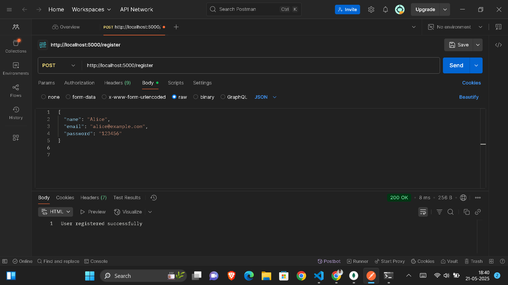
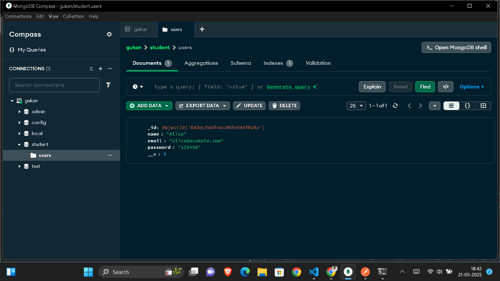
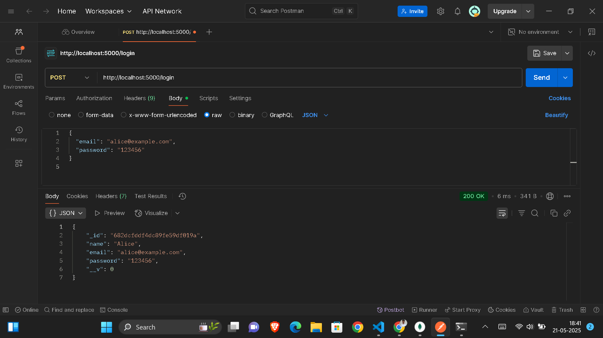
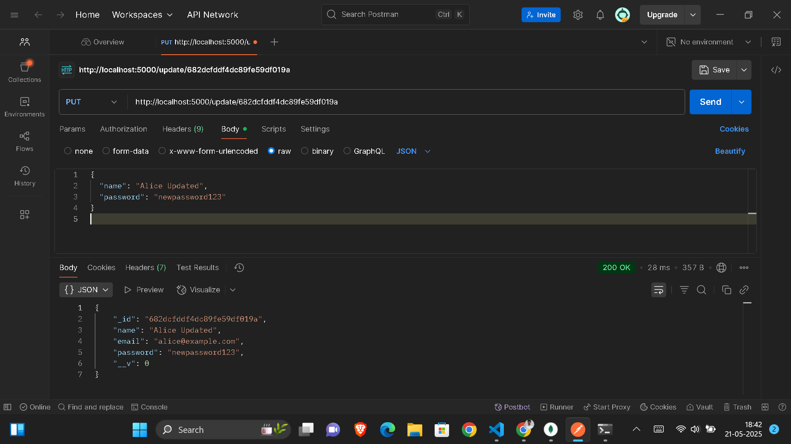
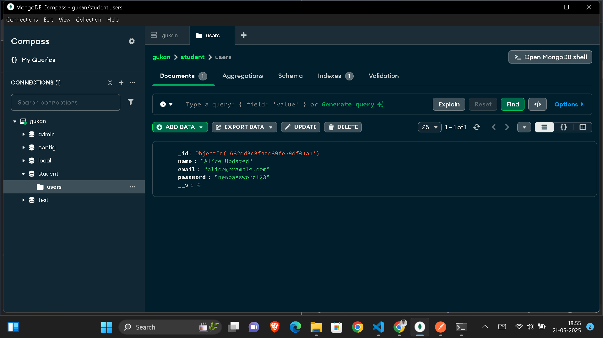
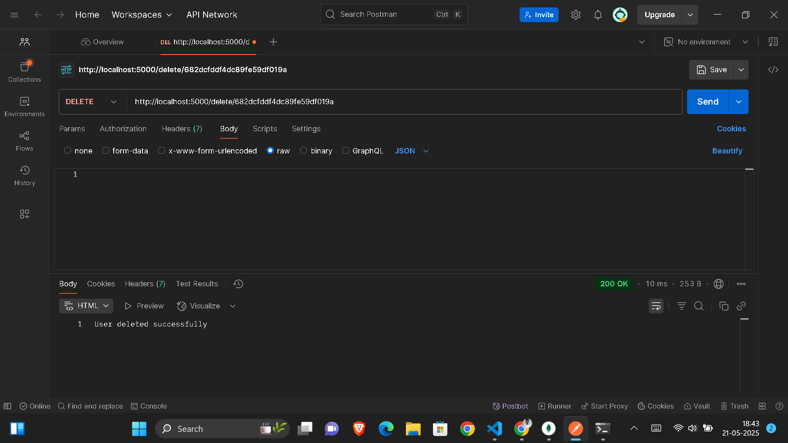
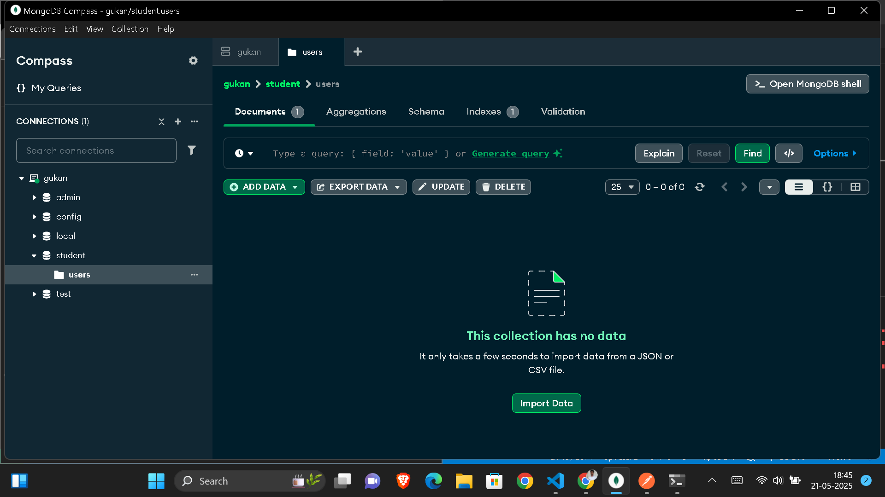

### 🔹 Register Operation

Resister opertion in Postman


Changes in MongoDB Collection


### 🔹 Login Operation

Login operation in Postman


### 🔹 Update Operation

Update Operation in Postman


Changes in MongoDB Collection


### 🔹 Delete Operation

Delete Operation in Postman


Changes in MongoDB Collection


# 🧩 MongoDB CRUD API with Node.js and Express

This is a simple CRUD (Create, Read, Update, Delete) REST API built using **Node.js**, **Express**, and **MongoDB** using **Mongoose**. The API allows users to register, log in, update their details, and delete their records.

---

## 🚀 Features

- ✅ Register new users
- ✅ Log in with email and password
- ✅ Update user details
- ✅ Delete a user by ID

---

## 📦 Technologies Used

- Node.js
- Express.js
- MongoDB
- Mongoose
- Postman (for testing)

---

## 📂 API Endpoints

| Method | Endpoint          | Description         |
|--------|-------------------|---------------------|
| POST   | `/register`       | Create a new user   |
| POST   | `/login`          | Log in an existing user |
| PUT    | `/update/:id`     | Update user by ID   |
| DELETE | `/delete/:id`     | Delete user by ID   |

---

## 🛠️ How to Run

1. Clone the repository  
   ```bash
   git clone https://github.com/Gukan2004/MongoDB_CRUD.git
   cd <your-folder>
